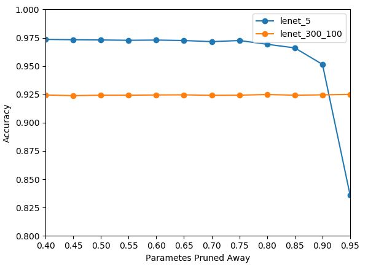

# Research

This repository is used to test different topics what i want to experiment with.

## Topic1 - pruning

### Result

All results are experimented by MNIST.
Non-pruned parameters mean non-zero parameters.

*Model* | *Accuracy* | *Parameters* | *Compression Rate*
:---: | :---: | :---: | :---:
Lenet_300_100 Ref | 97.97% | 266K(266,610) |
Lenet_300_100 Pruned | 92.46% | 15K(15,023) | 17x
Lenet_5 Ref | 98.32% | 29K(29,456) |
Lenet_5 Pruned | 95.15% | 1K(1,603) | 18x

Accuracy Graph for threshold determined by percentage of initial network weights.



All results are experimented by Imagenet-2012.

*Model* | *Accuracy* | *Parameters* | *Compression Rate*
:---: | :---: | :---: | :---:
Alexnet Ref | 54.85% | 61,100K(61,100,840) |
Alexnet Pruned | OO.OO% | 000K() | 00x
VGGnet_16 Ref | OO.OO% | 000K() |
VGGnet_16 Pruned | OO.OO% | 000K() | 00x

### Getting Start
#### Get lenet model file
- Get lenet_300_100 or lenet_5 model
- Possible example : {lenet_300_100-mnist}, {lenet_5-mnist}
```shell
python lenetClassifier.py --model=lenet_300_100 --dataset=mnist
```

#### Get Baseline Result
- Model : lenet, alexnet
- Dataset : mnist, imagenet
- Depending dimension of the input image, there are possible combinations of datasets and models.
- Possible example : {lenet_300_100-mnist}, {lenet_5-mnist}
- to be : {alexnet-imagenet}, {vggnet-imagenet}
```shell
python baseline.py --model=lenet_300_100 --dataset=mnist
```

#### Pruning & Retraining
- Depending dimension of the input image, there are possible combinations of datasets and models.
- possible example : {lenet_300_100-mnist}, {lenet_5-mnist}
- to be : {alexnet-imagenet}, {vggnet-imagenet}
```shell
python PruningRetraining.py --model=lenet_300_100 --dataset=mnist --pruningThresholds 0.5 0.6 0.7 0.8
```

#### Visualizing
```shell
python visualization.py --models lenet_300_100 lenet_5 --pruningList 0.4 0.5 0.6 0.7 0.8 0.9
```

## Topic2 - classification

### Result

All results are experimented. Acc() means accuracy(epoch/batch size).

*Dataset* | *Model* | *DNN Acc* | *BayesianNN Acc(MOPED)* | *BayesianNN Acc(BayesbyBackprop)* |
:---: | :---: | :---: | :---: | :---: |
MNIST | Lenet | 98.96%(30/256) | 00.00% | 9.8%(256/120) |
F-MNIST | Lenet | 87.96%(30/256) | 00.00% | 11.46%(256/120) |
MNIST | SCNN | 98.71%(30/256) | 00.00% | 14.94%(256/120) |
F-MNIST | SCNN | 86.56%(30/256) | 00.00% | 19.39%(256/120) |
CIFAR-10 | Alexnet | 85.91%(30/256) | 00.00% | 00.00%(0/0) |
CIFAR-10 | Vggnet | 79.8%(120/64) | 00.00% | 00.00%(0/0) |
CIFAR-10 | Vggnet | 81.36%(30/64) | 00.00% | 00.00%(0/0) |
CIFAR-10 | Resnet-18 | 94.18%(30/256) | 00.00% | 00.00%(0/0) |
CIFAR-10 | Resnet-34 | 94.79%(30/256) | 00.00% | 86.21%(256/120) |

#### Get Baseline Result
- Model : lenet, scnn, alexnet, vggnet, resnet
- Dataset : mnist, fmnist, cifar10
- Depending dimension of the input image, there are possible combinations of datasets and models.
```shell
python baseline.py --model=alexnet --dataset=mnist
```

## Topic3 - classification & pruning

### Result

All results are experimented. Acc() means accuracy(epoch/batch size).

*Dataset* | *Model* | *Prune Method* | *Top1 Acc* | Parameters |
:---: | :---: | :---: | :---: | :---: |
CIFAR-10 | Resnet-18 | None | 94.58%(30/256) | 11,689,512 |
CIFAR-10 | Resnet-34 | None | 94.86%(30/256) | 21,797,672 |

#### Get Baseline Result
- Model : resnet
- Dataset : cifar10
- Depending dimension of the input image, there are possible combinations of datasets and models.
```shell
python baseline.py --model=resnet --dataset=cifar10
```

#### Pruning by methods
```
python songhan.py
python fpgm.py
```

## Reference
- [Learning both Weights and Connections for Efficient Neural Networks](https://papers.nips.cc/paper/5784-learning-both-weights-and-connections-for-efficient-neural-network.pdf), accepted NIPS 2015
